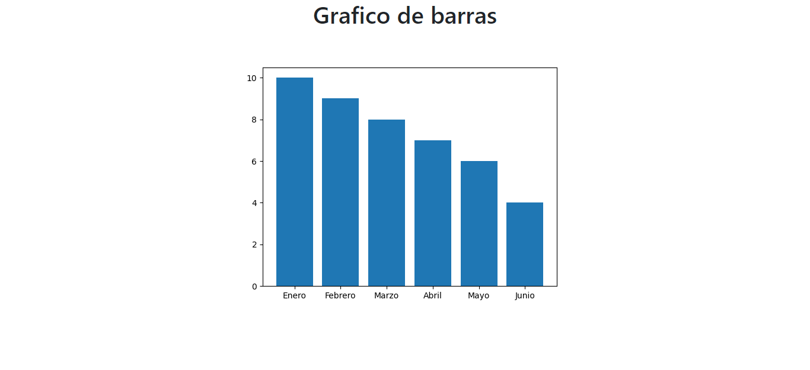

#   Gráfico de Departamentos y Empleados
<p aling="center">
    
</p>


##  Ejemplo 2 :
```py

```
### Resultado
<p aling="center">
    
</p>


##  Proceso de creación del proyecto:
1. Crea un directorio para tu proyecto, por ejemplo, `graficos_en_flask`

2. Accede al directorio desde la terminal de Windows y crea un ambiente virtual de Python con el siguiente comando:
`python -m venv venv`

3. Activar el ambiente virtual con el siguiente comando:
`venv\Scripts\activate` <br>
Por consola nos mostrara que emos accedido a `(venv)`

4. Instala Flask y Matplotlib en el ambiente virtual:
`pip install flask matplotlib` <br>
Si ejecutamos `pip list` visualizaremos a manera de lista las librerias instaladas

5. Crea un archivo `app.py` y crear el código en Python:

6. Crear la carpeta `templates` y crear el archivo `index.html` y su respectivo código

7. Una vez activado **(venv)** Ejecutar el siguiente comando para iniciar la aplicación Flask:
`python app.py`

8. Abre un navegador web y accede a la dirección http://localhost:5000/ <br>
Verás la página web con el gráfico generado por Matplotlib.