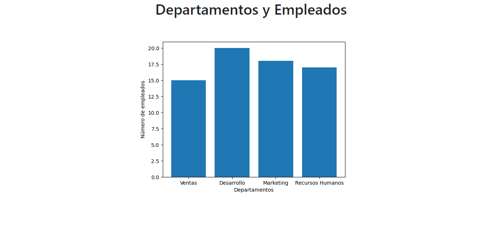

#  Ejemplo 3: Grafico de Barras con SQLITE3 
### Creación del código para `empleados.py`

```py
import sqlite3

con = sqlite3.connect("empleados.db")
cur = con.cursor()

# Crear la tabla empleados
cur.execute("""
CREATE TABLE IF NOT EXISTS empleados (
    id INTEGER PRIMARY KEY,
    nombre TEXT NOT NULL,
    edad INTEGER NOT NULL
)
""")

# Agregar algunos registros a la tabla empleados
registros = [
    ("Juan", 25),
    ("María", 29),
    ("Pedro", 31),
    ("Lucía", 33),
    ("David", 40)
]

cur.executemany("""
INSERT INTO empleados (nombre, edad)
VALUES (?, ?)
""", registros)

con.commit()
conn.close()
```
Con el siguiente comando `python empleados.py` se realizara la ejecución de las consultas, para crear/generar la base de datos  `empleados.db` . <br>
Finalmente ejecutar `python app.py`
### Resultado
<p aling="center">
    
</p>


##  Ejemplo 2: Gráfico de barras
```html
<!DOCTYPE html>
<html>
<head>
  <title>Gráfico de barras con Flask y Matplotlib</title>
  <link href="https://cdn.jsdelivr.net/npm/bootstrap@5.3.0-alpha1/dist/css/bootstrap.min.css" rel="stylesheet" integrity="sha384-GLhlTQ8iRABdZLl6O3oVMWSktQOp6b7In1Zl3/Jr59b6EGGoI1aFkw7cmDA6j6gD" crossorigin="anonymous">
</head>
<body>

    <div class="container center text-center">
        <h1>Gráfico de barras de Departamentos y Empleados</h1>
        
    </div>
    
</body>
</html>
```
```py
from flask import Flask, render_template
import matplotlib.pyplot as plt
import io
import base64

app = Flask(__name__)

@app.route("/")
def index():
    # Generar gráfico de barras
    labels = ['Enero', 'Febrero', 'Marzo', 'Abril', 'Mayo', 'Junio']
    values = [10, 9, 8, 7, 6, 4]
    fig = plt.figure()
    plt.bar(labels, values)

    # Convertir gráfico a imagen y codificar en Base64
    img = io.BytesIO()
    plt.savefig(img, format='png')
    img.seek(0)
    encodedImage = base64.b64encode(img.getvalue()).decode('utf-8')

    return render_template('index.html', encodedImage=encodedImage)

if __name__ == "__main__":
    app.run(debug=True)
```
### Resultado
<p aling="center">
    
</p>


##   Ejemplo 1: Gráfico de Departamentos y Empleados
```html
<!DOCTYPE html>
<html>
<head>
  <title>Gráfico de barras con Flask y Matplotlib</title>
  <link href="https://cdn.jsdelivr.net/npm/bootstrap@5.3.0-alpha1/dist/css/bootstrap.min.css" rel="stylesheet" integrity="sha384-GLhlTQ8iRABdZLl6O3oVMWSktQOp6b7In1Zl3/Jr59b6EGGoI1aFkw7cmDA6j6gD" crossorigin="anonymous">
</head>
<body>

    <div class="container center text-center">
        <h1>Departamentos y Empleados</h1>
        
    </div>
    
</body>
</html>
```

```py
from flask import Flask, render_template
import matplotlib.pyplot as plt
import io
import base64


app = Flask(__name__)

@app.route("/")
def index():
    # Crea un gráfico de barras con datos ficticios para la cantidad de empleados por departamento
    departamentos = ['Ventas', 'Desarrollo', 'Marketing', 'Recursos Humanos']
    empleados = [15, 20, 18, 17]

    fig, ax = plt.subplots()
    ax.bar(departamentos, empleados)
    ax.set_xlabel("Departamentos")
    ax.set_ylabel("Número de empleados")

    # Convierte la figura a una imagen PNG
    pngImage = io.BytesIO()
    plt.savefig(pngImage, format='png')
    pngImage.seek(0)
    encodedImage = base64.b64encode(pngImage.getvalue()).decode('utf-8')

    return render_template("index.html", encodedImage=encodedImage)


if __name__ == "__main__":
    app.run(debug=True)
```
### Resultado
<p aling="center">
    
</p>


##  Proceso de creación del proyecto:
1. Crea un directorio para tu proyecto, por ejemplo, `graficos_en_flask`

2. Accede al directorio desde la terminal de Windows y crea un ambiente virtual de Python con el siguiente comando:
`python -m venv venv`

3. Activar el ambiente virtual con el siguiente comando:
`venv\Scripts\activate` <br>
Por consola nos mostrara que emos accedido a `(venv)`

4. Instala Flask y Matplotlib en el ambiente virtual:
`pip install flask matplotlib` <br>
Este es necesario para el ejercicio 3: `pip install sqlite3` <br>
Si ejecutamos `pip list` visualizaremos a manera de lista las librerías instaladas

5. Crea un archivo `app.py` y crear el código en Python:

6. Crear la carpeta `templates` y crear el archivo `index.html` y su respectivo código

7. Una vez activado **(venv)** Ejecutar el siguiente comando para iniciar la aplicación Flask:
`python app.py`

8. Abre un navegador web y accede a la dirección http://localhost:5000/ <br>
Verás la página web con el gráfico generado por Matplotlib.
